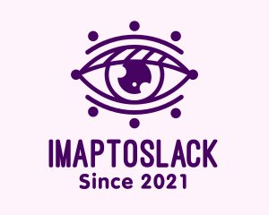

[](https://github.com/rolfwessels/imap-to-slack/releases)
[](https://github.com/rolfwessels/imap-to-slack/licence.md)




# Imap to slack

I hate checking email. So this app lets me know when I need to check my mail.

## Getting started

Open the docker environment to do all development and deployment

```bash
# bring up dev environment
make build up
# test the project
make test
# build the project ready for publish
make publish
```

## Available make commands

### Commands outside the container

- `make up` : brings up the container & attach to the default container
- `make down` : stops the container
- `make build` : builds the container

### Commands to run inside the container

- `make  version` : Set current version number project"
- `make  start` : Run the project"
- `make  test` : Test the project"
- `make  publish` : Publish the project"
- `make  deploy` : Deploy the project"

## Research

- <https://github.com/jstedfast/MailKit> For reading Imap
- <https://github.com/mrb0nj/Slack.Webhooks> Sending to slack
